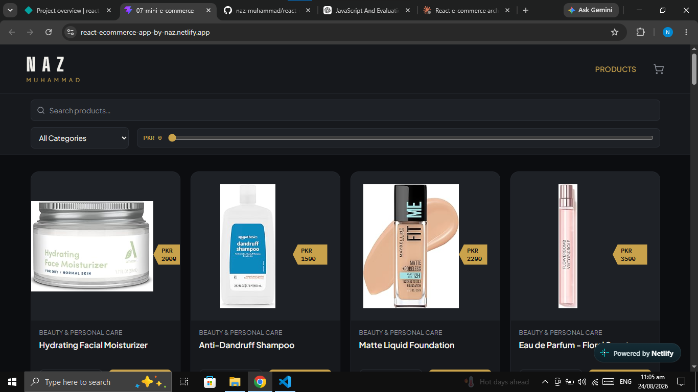
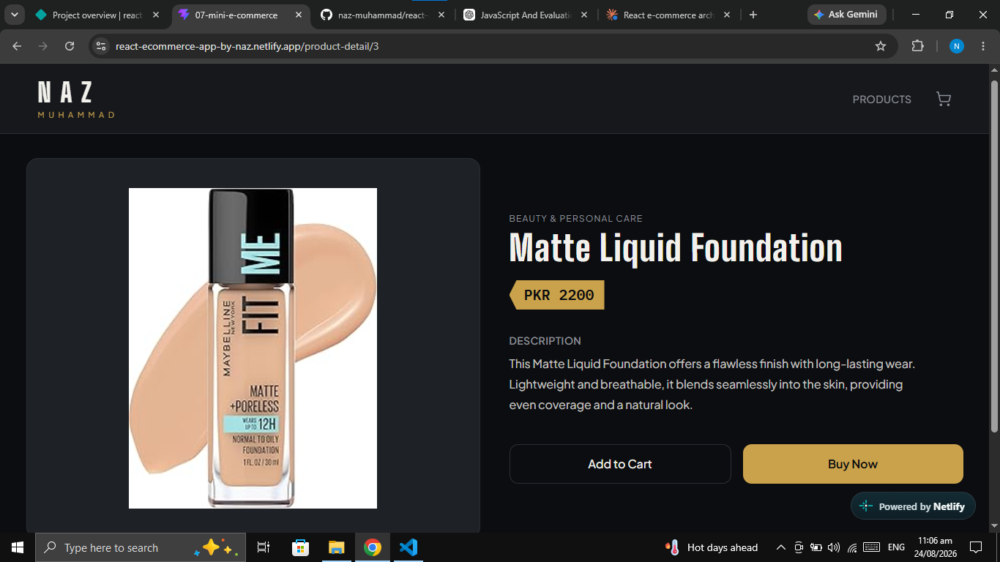
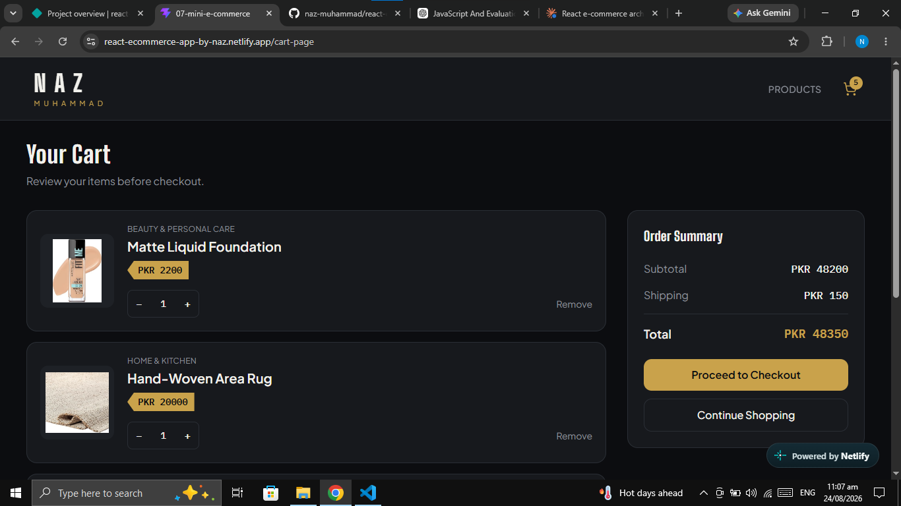
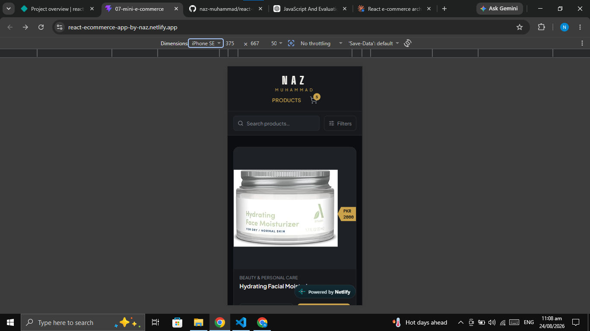

# React E-Commerce App

A front-end e-commerce demo built with **React + Vite**, created as a learning project to practice core React concepts — component architecture, state management, Context API, React Router, and derived-state logic — on top of a real product API.


**Live demo:** [react-ecommerce-app-by-naz.netlify.app](https://react-ecommerce-app-by-naz.netlify.app/)
**Repository:** [github.com/naz-muhammad/react-ecommerce-app](https://github.com/naz-muhammad/react-ecommerce-app)

---

## Screenshots

<p align="center">
  
</p>

<p align="center">
  
</p>

<p align="center">
  
</p>

<p align="center">
  
</p>

---

## Overview

This project is a browsable product catalog with search, filtering, product detail pages, and a working shopping cart. Product data comes from a public JSON API, and cart state is managed entirely on the client through React Context — there is no backend.

It was built and then iteratively redesigned: the application logic (fetching, filtering, cart behavior) was implemented first, and the current version layers a custom dark, "price-ticket" themed UI on top of that same logic, built mobile-first with Tailwind CSS.

## Features

- **Product listing** — fetched from a public API and rendered as a responsive grid
- **Search** — filters products by name as you type
- **Category filtering** — dropdown built from the unique categories in the fetched data
- **Price filtering** — range slider filter against product price
- **Product detail page** — dedicated page per product via a dynamic route
- **Add to cart** — from both the product grid and the product detail page
- **Duplicate prevention** — adding a product already in the cart increases its quantity instead of creating a second entry
- **Quantity controls** — increase/decrease per cart item, with automatic removal at zero
- **Remove from cart** — explicit remove action per item
- **Cart item count** — live badge on the header cart icon
- **Order summary** — subtotal, flat shipping fee, and total, derived from cart state
- **Responsive UI** — mobile-first layouts across the header/filters, product grid, product detail page, and cart
- **Redesigned UI system** — dark theme with a consistent brass/"price-ticket" accent motif

## Tech Stack

| Category | Technology |
|---|---|
| UI library | React |
| Build tool | Vite |
| Routing | React Router (`react-router-dom`) |
| Styling | Tailwind CSS v4 |
| Icons | Lucide React |
| Data fetching | Native Fetch API |
| Fonts | Big Shoulders Display, Plus Jakarta Sans, IBM Plex Mono (Google Fonts) |

No backend, database, or state-management library beyond React's built-in Context API is used.

## Project Structure

```
src/
├── App.jsx                    # Root component — owns cart state, provides CartContext, defines routes
├── main.jsx                   # Entry point — mounts App inside BrowserRouter
├── index.css                  # Tailwind import + custom design tokens (@theme)
│
├── components/
│   ├── Header.jsx             # Sticky header — composes Logo + Navbar
│   ├── Logo.jsx                # Brand mark
│   ├── Navbar.jsx              # Nav links + cart icon with live item-count badge
│   ├── Footer.jsx              # Site footer
│   ├── Product.jsx             # Product card (grid item) — image, price, add-to-cart, view-detail
│   ├── ProductFilters.jsx      # Search / category / price controls (presentational)
│   ├── Cart.jsx                 # Single cart line-item — image, price, quantity controls, remove
│   └── OrderSummary.jsx        # Subtotal / shipping / total + checkout & continue-shopping actions
│
└── pages/
    ├── ProductsPage.jsx        # Fetches products, owns filter state/logic, renders ProductFilters + grid
    ├── ProductDetailPage.jsx   # Fetches a single product by :productId, renders detail view
    └── CartPage.jsx            # Reads cart from context, renders Cart list + OrderSummary
```

Components are split by **responsibility**, not by file count: `ProductFilters` and `OrderSummary` exist because they're distinct, reusable UI blocks with a clear single job (display controls / display a total), not because every section needed its own file.

## Data Flow

**Product browsing:**

```
API (products.json)
  → ProductsPage (useEffect + fetch, stores in state)
    → filtering (search + category + price, computed in ProductsPage)
      → ProductFilters (renders controls, reports changes back up via props)
      → filteredProducts.map() → Product (renders each card)
```

`ProductsPage` owns the raw data and all filtering logic. `ProductFilters` is purely presentational — it receives current values and `onChange` callbacks as props and has no filtering logic of its own.

**Product detail:**

The route `/product-detail/:productId` is matched by React Router, and `ProductDetailPage` reads the `:productId` segment with `useParams()`. Since the API has no single-product endpoint, the page fetches the full product list and finds the matching entry with `Array.prototype.find()`.

**Cart:**

```
Product / ProductDetailPage → addToCart(product)
  → CartContext (state lives in App.jsx)
    → Navbar (reads cart → cart item count badge)
    → CartPage (reads cart → total via reduce)
      → Cart (renders each line item, calls increase/decrease/remove)
      → OrderSummary (receives computed total as a prop, renders subtotal/shipping/total)
```

Cart state itself lives in a single `useState` call in `App.jsx` and is exposed to the rest of the tree through `CartContext`, so any component that needs cart data or actions consumes it with `useContext(CartContext)` rather than receiving it through prop drilling.

## Cart Logic

- Cart state is a single array of `{ product, quantity }` objects, held in `App.jsx`.
- `addToCart(product)` checks the array for an existing entry with the same product ID:
  - if found, it increments that entry's `quantity` (this is the duplicate-prevention behavior — a product can never appear twice in the cart)
  - if not found, it appends a new `{ product, quantity: 1 }` entry
- `increaseQuantity(productId)` / `decreaseQuantity(productId)` map over the cart and adjust the matching item's quantity; `decreaseQuantity` also filters out any item whose quantity drops to `0`, so removing the last unit removes the item.
- `removeFromCart(productId)` filters the item out directly, regardless of quantity.
- **Cart count** (shown on the header icon) is derived with `cart.reduce()`, summing every item's quantity — it is not stored as separate state.
- **Cart total** (shown in `OrderSummary`) is derived the same way in `CartPage`, reducing `price × quantity` across all items — also not stored separately.
- All four cart actions plus the raw `cart` array are exposed through `CartContext`, so `Product`, `Navbar`, `Cart`, and `CartPage` each pull only what they need via `useContext`.

## React Concepts Demonstrated

#### State
`useState` manages cart contents (`App.jsx`), fetched product data and filter inputs (`ProductsPage.jsx`), the single fetched product and its loading state (`ProductDetailPage.jsx`), and small UI-only state like the mobile filter drawer's open/closed flag (`ProductFilters.jsx`).

#### Props
Presentational components receive data and callbacks from their parent rather than owning logic themselves — e.g. `Product` receives `productData`, `Cart` receives `cartItem`, and `OrderSummary` receives a computed `total` and an `onContinueShopping` handler.

#### Context API
`CartContext` (created with `createContext` in `App.jsx`) solves the problem of cart state being needed in components that aren't direct parents/children of each other — the cart icon in `Navbar`, the "Add to Cart" buttons in `Product` and `ProductDetailPage`, and the full cart UI in `CartPage` all consume the same context instead of passing cart state down through every intermediate component.

#### React Router
Three routes are defined in `App.jsx`: `/` (product listing), `/product-detail/:productId` (dynamic product detail route), and `/cart-page` (cart). `NavLink` is used in `Navbar` for active-state-aware navigation.

#### useParams
Used in `ProductDetailPage` to read the `productId` segment out of the current URL and use it to look up the matching product.

#### useNavigate
Used in `Product` (navigating to a product's detail page) and in `CartPage` (the "Continue Shopping" button navigating back to `/`).

#### useEffect
Used in `ProductsPage` and `ProductDetailPage` to fetch data on mount (and, in the detail page, to re-fetch when `productId` changes).

#### Array Methods
- `map` — rendering product/cart lists, transforming cart items on quantity change, extracting category values
- `filter` — search/category/price filtering in `ProductsPage`, removing an item in `removeFromCart`, dropping zero-quantity items in `decreaseQuantity`
- `reduce` — computing the cart item count (`Navbar`), the cart total (`CartPage`), and the highest product price for the price slider's range (`ProductsPage`)
- `find` — locating an existing cart entry in `addToCart`, and locating the matching product by ID in `ProductDetailPage`

## UI / Design

The current interface uses a dark, "premium" theme built around a small custom design system defined in `index.css`:

- **Color palette** — near-black background/surfaces, off-white text, and a single brass/gold accent color used consistently for prices, active states, and primary buttons
- **Typography** — a condensed display face for headings/branding, a body sans-serif for text, and a monospace face reserved specifically for prices and quantities (tabular numerals)
- **Signature element** — a recurring "price ticket" badge (a notched, brass-colored tag) used for every price shown across the product card, product detail page, and cart
- **Product cards** — fixed-aspect-ratio image containers so products with differently sized source images still line up evenly in the grid
- **Header/filters** — a sticky header, with search/category/price controls rendered as a strip directly beneath it; on mobile, category and price collapse behind a "Filters" toggle to keep the header compact
- **Product detail page** — two-column layout on desktop (image + details), a single stacked column on mobile
- **Cart page** — cart items in a scannable list, with the order summary appearing beside the list on desktop and below it on mobile
- **Responsive design** — mobile-first Tailwind breakpoints throughout, rather than a single desktop layout scaled down

## API / Data

Product data is fetched from a public, static JSON endpoint:

```
https://kolzsticks.github.io/Free-Ecommerce-Products-Api/main/products.json
```

- `ProductsPage` fetches the full list once on mount and filters it client-side.
- `ProductDetailPage` fetches the same full list and finds the single matching product client-side (there's no per-product API endpoint).
- There is **no backend, database, or authentication** — all data is either fetched from this static JSON file or held in memory in React state. Nothing is persisted between sessions.

## Getting Started

```bash
# clone the repository
git clone https://github.com/naz-muhammad/react-ecommerce-app.git
cd react-ecommerce-app

# install dependencies
npm install

# run the dev server
npm run dev
```

## Limitations

This is a front-end learning project, not a production application:

- No backend, database, or authentication
- Cart state is held in memory only — it resets on page refresh (no `localStorage`/persistence)
- "Proceed to Checkout" is currently a UI-only button with no checkout flow behind it
- No real payment processing
- Product data depends entirely on a third-party static JSON file, with no fallback if it's unavailable

## Future Improvements

- Persist cart state with `localStorage`
- A real checkout flow (even a mock one) with order confirmation
- Basic authentication / user accounts
- Reusable data-fetching hook to remove the duplicated fetch logic between `ProductsPage` and `ProductDetailPage`
- Explicit loading/error UI states (currently a plain "Loading…"/"Product not found" text)
- Accessibility pass (focus states, ARIA labels on icon-only buttons)
- Automated tests

---

Built by [Naz Muhammad](https://github.com/naz-muhammad) as a hands-on React learning project.